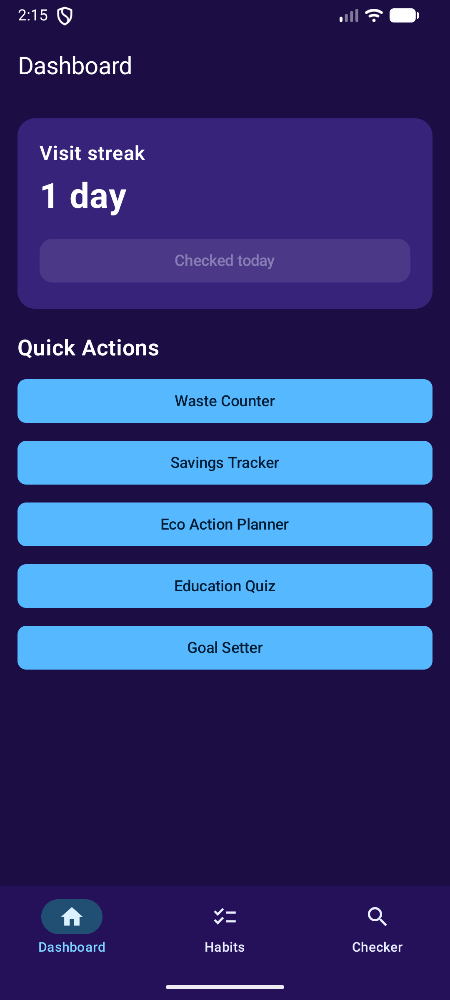
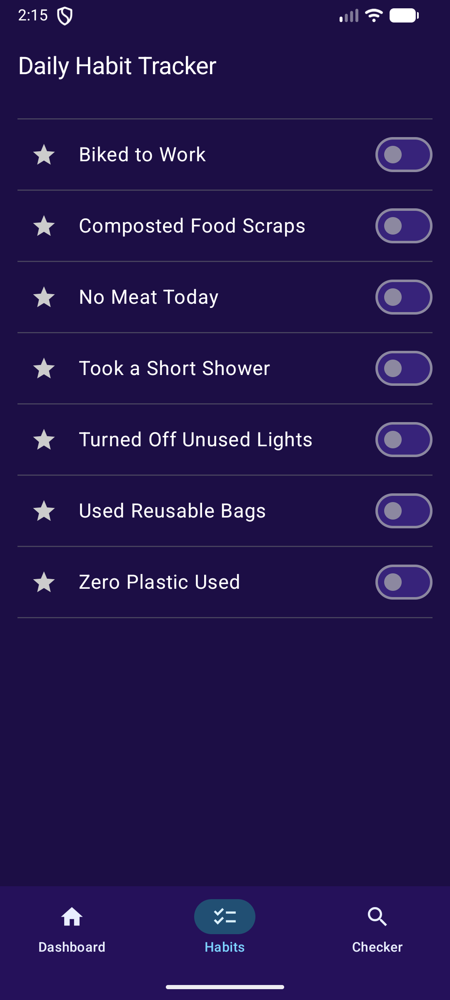
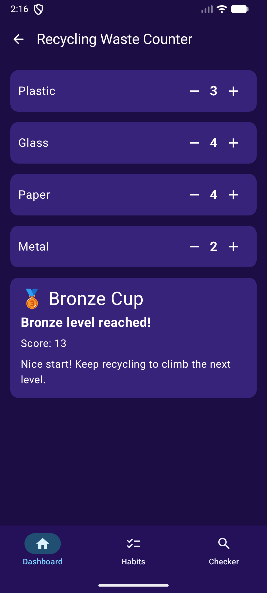
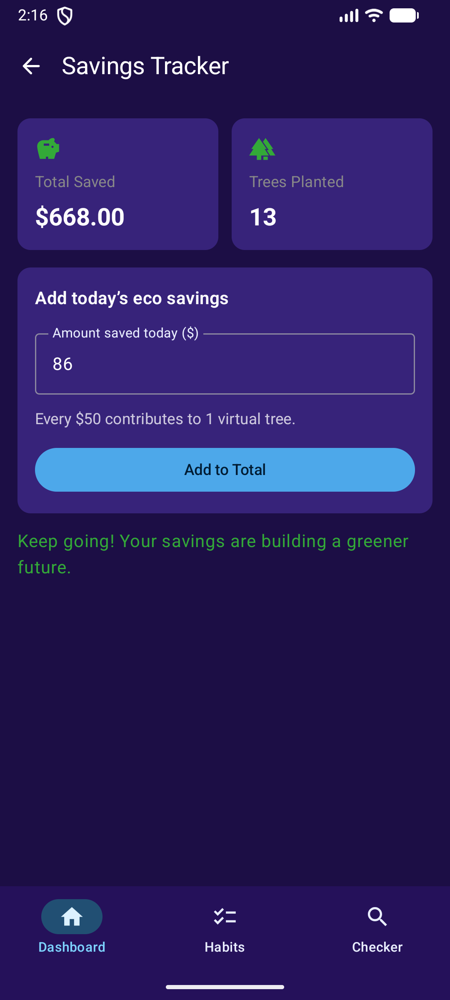
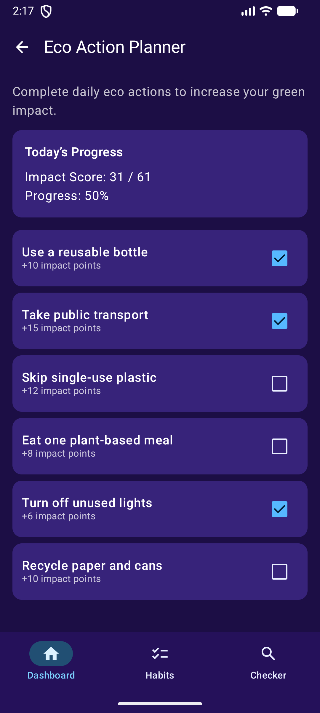
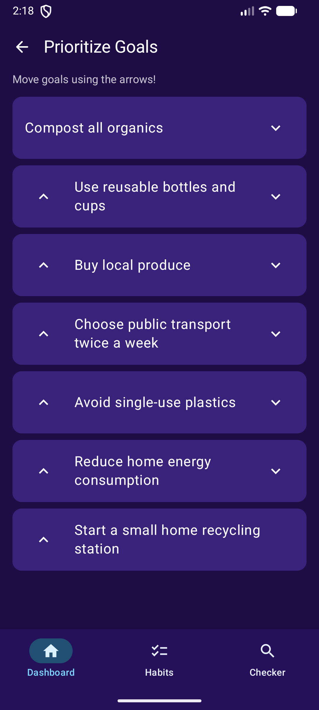
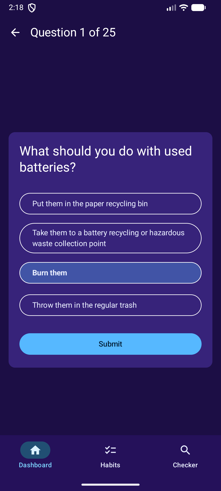
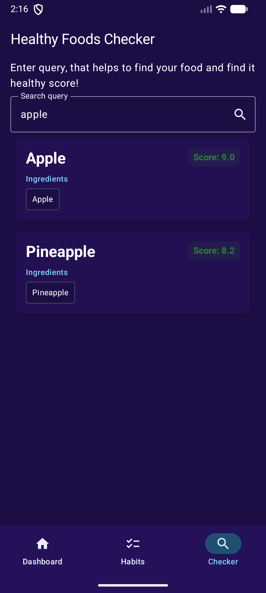

# EcoTrack

EcoTrack is an Android app for building eco-friendly habits and tracking sustainability progress. It combines habit tracking, waste counting, savings tracking, goal planning, a recycling quiz, and a healthy food checker in one offline-first experience.

## Features

- Daily check-in streak tracking
- Habit management with completion and favorite states
- Waste counter by category
- Savings tracker with virtual tree impact
- Eco action planner
- Prioritize goals with priority ordering
- Recycling knowledge quiz
- Healthy food checker with searchable results
- Local persistence using Room and DataStore

## Tech Stack

- Kotlin
- Jetpack Compose
- Material 3
- Navigation Compose
- Room
- DataStore Preferences
- Koin for dependency injection
- Kotlinx Serialization

## App Package

- `com.ecohabit.ecotrack`

## Requirements

- Android Studio Hedgehog or newer
- JDK 11
- Android SDK 36

## Run the App

1. Open the project in Android Studio.
2. Let Gradle sync finish.
3. Run the `app` module on an Android device or emulator.

Or from the terminal:

```bash
./gradlew assembleDebug
```

## Project Structure

```text
app/src/main/java/com/ecohabit/ecotrack/
  data/        local storage, quiz, food data, and preferences
  di/          Koin dependency injection setup
  ui/          Compose screens, view models, and theme
```

## Screenshots

The screenshots below are stored in the repository root under `screenshots/`.

| Dashboard | Daily Habit Tracker | Waste Counter |
| --- | --- | --- |
|  |  |  |

| Savings Tracker | Eco Action Planner | Prioritize Goals |
| --- | --- | --- |
|  |  |  |

| Quiz | Healthy Foods Checker |
| --- | --- |
|  |  |

## Notes

- The app stores data locally on the device.
- The dashboard includes a daily check-in flow that updates the streak counter.
- Tree savings are derived from the total savings value in the app.

## License

No license file is included in this repository yet.
